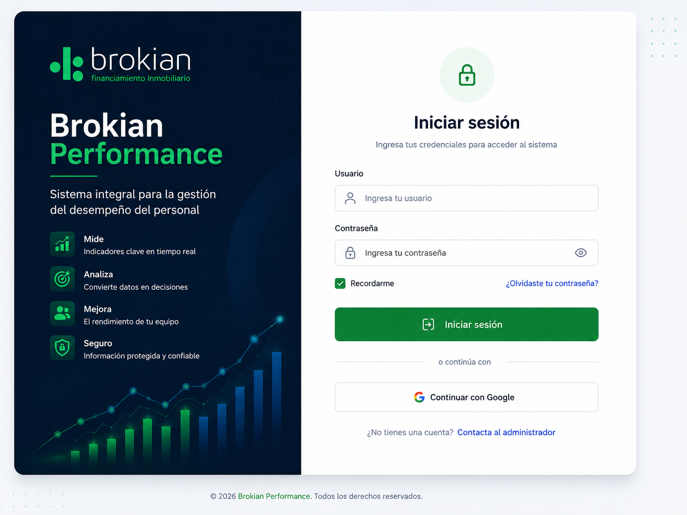
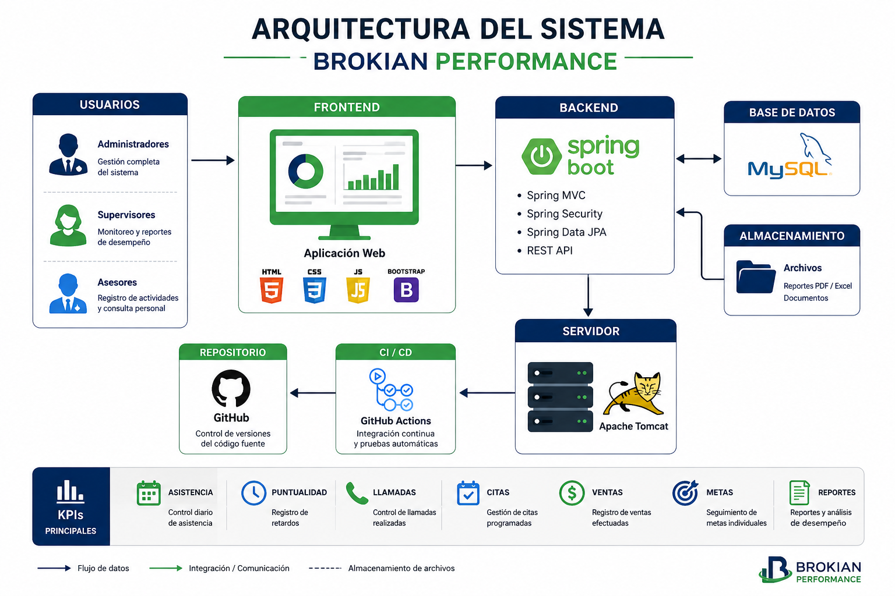

<div align="center">

# 🚀 Brokian Performance

### Sistema Integral para la Gestión del Desempeño del Personal


</div>

---

# 📖 Descripción

Brokian Performance es una plataforma web desarrollada para administrar el desempeño del personal mediante indicadores clave (KPIs).

El sistema permite:

- ✅ Asistencia
- ✅ Puntualidad
- ✅ Ventas
- ✅ Metas
- ✅ Rendimiento
- ✅ Dashboard
- ✅ Reportes

---

# 📸 Vista previa

<p align="center">



</p>

---

# 🎯 Problema

Actualmente la empresa administra la información mediante hojas de cálculo y registros independientes.

Esto provoca:

❌ Información dispersa

❌ Reportes tardados

❌ Difícil seguimiento

❌ Poco control de metas

---

# 💡 Solución

Brokian Performance centraliza toda la información del personal en una sola plataforma.

```
Asistencia
↓

Ventas

↓

Metas

↓

KPIs

↓

Dashboard

↓

Reportes
```

---

# 🏗 Arquitectura

<p align="center">



</p>

---

# 📂 Estructura

```text
src
│
├── controller
├── model
├── repository
├── service
├── config
├── dashboard
└── reports
```

---

# 📈 Dashboard

El sistema mostrará:

📊 Asistencia

📈 Ventas

🎯 Metas

📞 Llamadas

📅 Citas

👨‍💼 Rendimiento

---

# 🛠 Tecnologías

| Tecnología | Uso |
|------------|------|
| Java 17 | Backend |
| Spring Boot | Framework |
| Maven | Dependencias |
| GitHub | Versionamiento |
| GitHub Actions | Integración continua |
| MySQL | Base de datos |
| JUnit | Pruebas |

---

# 🚀 Instalación

```bash
git clone https://github.com/usuario/Brokian-Performance.git

cd Brokian-Performance

mvn clean install

mvn spring-boot:run
```

---

# 🧪 Pruebas

```bash
mvn test
```

---

# 👤 Usuario

Puede:

- Registrar asistencia
- Consultar metas
- Registrar ventas
- Consultar indicadores

---

# 👨‍💼 Administrador

Puede:

- Administrar usuarios
- Crear metas
- Dashboard
- Reportes

---

# 🌳 Flujo Git

```text
main
│
develop
│
├── feature/login
├── feature/asistencia
├── feature/ventas
├── feature/metas
├── feature/reportes
└── feature/dashboard
```

---

# 📅 Roadmap

## ✅ v1.0

- Login

- Empleados

- Asistencia

- Ventas

- Metas

- Dashboard

---

## 🚀 v2.0

- Excel

- PDF

- App móvil

- IA

---

# 🤝 Contribuir

```bash
git clone

git checkout develop

git checkout -b feature/nueva

git commit

git push

Pull Request
```

---

# 👨‍💻 Autor

Juan Felipe

Proyecto Integrador

Universidad Tecmilenio

2026
